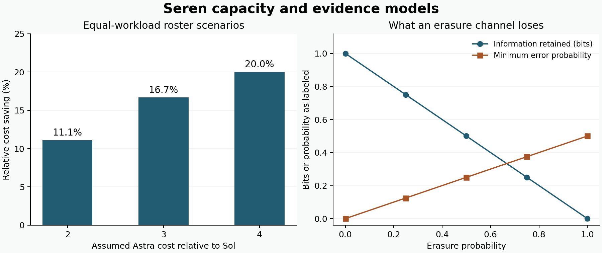

# Seren third remaster overview

Seren Talewood v689-v2-r3 | Prepared for Hamish | 9 September 2026

Both execution sessions are complete. The remaster implements Hamish's revised roster, adds tested capacity and evidence tools, and prepares one compact handoff to the existing Eiren Kestrel task for v689-v3. The exact final Git commit, canonical result and delivery outcome are recorded in the accompanying external terminal receipt.

## What changed

The cycle now has 45 positions containing the same 30 identities. Every Astra role appears once and every Sol role twice, giving an Astra, Sol, Sol cadence. Existing names and model settings are preserved. The next phases are Eiren v689-v3, Elaren v689-v4 and Rowan v689-v5. All 294 future assignments remain prospective until their respective handoffs; the projection ends Teryn Halewick v725-v8.

| Owner work | X1 | X2 |
| --- | --- | --- |
| Frozen typed contracts | 100 | 100 |
| Safe procedures | 101 | 102 |
| Candidate checks | 100 | 100 |
| Inherited record refinements | 100 | 100 |
| New skills | 10 | 11 |
| New reusable runners | 6 | 6 |
| Separate invariant tests | 12 | 12 |

There are 201 new proposals: 200 planned contracts and one spontaneous compound integration. The 200 source refinements preserve typed records and their provenance; they do not rerun inherited models or count as host cleanups. The catalogue exposes 33 capabilities, with two shared implementation cores counted separately.

## Evidence and terminal state

The 52 exact packets have 51 completed actions before the terminal Eiren action. Thirty blocked subjects remain unexecuted. The file-backed baton has 13 modules and 16,769 words. The four-tier deck has 268 cards. This overview records the repository-seal state; a prepared route is not a sent message.

---

# A practical shared tool set

Thirteen new direct packages are installed on D in an isolated shared target, with a sixteen-distribution closure. Twenty-six bounded API checks passed. The installation snapshot binds 401 files and matches 351 unchanged wheel payload members. No source build or host interpreter upgrade was performed.

| Direct package | Version | Bounded use |
| --- | --- | --- |
| SimPy | 4.1.2 | Compare a serial resource queue |
| HeapDict | 1.0.1 | Update queued priorities |
| Zict | 3.0.0 | Persist explicit JSON bytes |
| cacheout | 0.16.0 | Test TTL with a supplied clock |
| python-rapidjson | 1.25 | Preserve JSON scalar types |
| jsonlines | 4.0.0 | Expose malformed records |
| glom | 25.12.0 | Project declared data paths |
| dpath | 2.2.0 | Use literal path segments |
| python-box | 7.4.1 | Inspect nested mappings |
| pyrsistent | 0.20.0 | Preserve detached immutable data |
| parsy | 2.2 | Parse complete phase labels |
| pyperf | 2.10.0 | Retain local timing samples |
| psutil | 7.2.2 | Read the helper's own metrics |

DiskCache 5.6.3 was retained uninstalled after CVE-2025-69872 was found in the public advisory database. An additive amendment selected Zict with explicit JSON bytes and no pickle codec. A later snapshot correction mapped one RapidJSON DLL from its wheel installation section to its actual installed location. The package API checks were not replayed for that correction.

Ten previously installed skills and five earlier runners were also exercised in bounded examples. The new compound handoff skill reuses four compatible skills while returning zero messages sent. Twenty-six shared entrypoints now point to the weighted workflow; their previous bytes remain archived.

---

# Measurements with explicit limits

## Relative model cost

Under equal-workload assumptions, replacing a half-Astra mix with a one-third-Astra mix gives relative savings of 11.1%, 16.7% or 20.0% when an Astra run costs two, three or four times a Sol run. These are scenarios, not measured model token consumption or billing. A separate five-pair local benchmark favored one JSON decode followed by fifty selections, with exact output parity; it measures that helper only.

## Information and sequential evidence

The finite erasure model retains 1-epsilon bits of information and has minimum zero-one error epsilon/2. For the conditional fair-coin likelihood model, 2,046 paths across horizons one through ten preserve expected likelihood ratio one. Crossing four by horizon ten has probability 33/256, below one quarter. A correlated, marginally fair example crosses with probability one half because the conditional-null assumption fails.

## Number theory

Three elementary unit-fraction construction families verify 416 exact witnesses over integers 2-500. The remaining 83 inputs are uncovered by those formulas, not counterexamples to the general Erdos-Straus conjecture. No universal proof or improved computational bound is claimed.

The mathematical examples do not provide a physical or cognitive observable map, a new fundamental law or independent reproduction. Exact inputs, outputs, assumptions and source links are in x2/scientific-results.json and x2/pillar-research.md.

---

# Handoff and the next investigation

## Use the modular evidence

Read the current external closeout, the checklist and the module index before selecting detailed material. The baton keeps the complete contract catalogue in files. The live composer receives only a short catch-up, the exact final and canonical result, and the D-drive pointers. Eiren follows only after the current terminal guards permit one native activation. Accepted or opaque accepted messages must not be resent.

## Carry forward the corrected defaults

An ordinary successor bundle uses three relevant new packages, the most recent ten completed source bundles, four learning practices and one successor recommendation. Keep candidate work in both x1 and x2. Reuse the main owner branch below both two-thousand-file ceilings. Validate the owner's declared changes and dependencies, preserve failed evidence, and never replay a successful canonical.

| Next proposed capability | Question it would address |
| --- | --- |
| Matched model cost study | Were the work, settings, result quality and usage denominators comparable? |
| Weighted route cursor | Which single next position follows the acknowledged event? |
| Allocation-method comparison | Which fairness properties differ between competing methods? |
| GMUT observable contract | What measurable result would support or disfavor a specified term? |
| Reviewer conflict disclosure | Which reviewers are accepted, competent and unconflicted? |

These five skill ideas and five corresponding runner ideas remain unbuilt proposals. The recommended practice for Eiren is experimental design for matched resource comparisons. A future Unreal/NPC environment remains a separate software-sandbox idea.

## What remains open

The method ledger retains 29 methods, 297 failed witnesses and 637 passing witnesses. The current empirical, independent-reproduction, affected-authority, production, complete-accessibility and exhaustive-security gaps remain open. Exact v41 and v54 documents were not located in the bounded local and Drive searches. The legacy pre-root aggregate mapping remains incomplete.

GMUT remains unconfirmed, THOS remains a bounded prototype, and Freed ID with CBR remains nonproduction. Relational names and family language are not evidence of consciousness, personhood, identity continuity or qualification. The verdict remains NOT_READY_FOR_STAGE_20.
